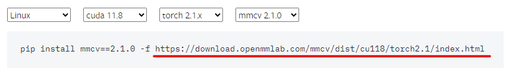

# MMPose_Note
# 基于manjaro
[mmpose官方文档](https://mmpose.readthedocs.io/zh-cn/latest/installation.html)

## pip使用国内源

```bash
##临时
pip install xxx -i https://mirrors.163.com/pypi/simple
##永久
pip config set global.index-url https://pypi.tuna.tsinghua.edu.cn/simple
```

## 挂代理
. ~/proxy.sh
```bash
HOST=127.0.0.1
PORT=7890
export http_proxy="http://$HOST:$PORT"
export https_proxy="http://$HOST:$PORT"
```
## Docker(彻底的环境隔离)  
[安装及使用指导](https://www.runoob.com/docker/docker-command-manual.html)  
[DockerHub（镜像下载）](https://hub.docker.com/)

## Pytorch
[Pytorch](https://pytorch.org/)  
验证
```bash
python -c 'import torch;print(torch.__version__)'
```

## MMCV 建议找轮子
[MMCV安装文档](https://mmcv.readthedocs.io/en/latest/get_started/installation.html)



示例
```bash
wget https://download.openmmlab.com/mmcv/dist/cu118/torch2.1.0/mmcv-2.1.0-cp310-cp310-manylinux1_x86_64.whl  
  
pip install mmcv-2.1.0-cp310-cp310-manylinux1_x86_64.whl 
```
## 验证安装
```bash
mim download mmpose --config td-hm_hrnet-w48_8xb32-210e_coco-256x192  --dest .  

python demo/image_demo.py tests/data/coco/000000000785.jpg td-hm_hrnet-w48_8xb32-210e_coco-256x192.py td-hm_hrnet-w48_8xb32-210e_coco-256x192-0e67c616_20220913.pth --out-file vis_results.jpg --draw-heatmap
```

## 模型部署
[MMdeploy](https://mmdeploy.readthedocs.io/zh-cn/latest/01-how-to-build/build_from_source.html)
```bash
git clone https://github.com/open-mmlab/mmdeploy --recursive 
或
git clone -b main https://github.com/open-mmlab/mmdeploy.git MMDeploy
cd MMDeploy
git submodule update --init --recursive
安装
mim install -e .
```
[Tensorrt](https://aur.archlinux.org/packages/tensorrt)
```bash
paru -S tensorrt
```
## 模型导出
onnxruntime
```bash
python tools/deploy.py configs/mmpose/pose-detection_simcc_onnxruntime_dynamic.py ../mmpose/projects/rtmpose/rtmpose/body_2d_keypoint/rtmpose-m_8xb256-420e_coco-256x192.py https://download.openmmlab.com/mmpose/v1/projects/rtmposev1/rtmpose-m_simcc-aic-coco_pt-aic-coco_420e-256x192-63eb25f7_20230126.pth demo/resources/human-pose.jpg --work-dir rtmpose-ort/rtmpose-m --device cpu --show --dump-info   
    # 导出 sdk info
```

TensorRT
```bash
## 依赖
export LD_LIBRARY_PATH=/opt/tensort/lib:$LD_LIBRARY_PATH

# 导出 sdk info
python tools/deploy.py configs/mmpose/pose-detection_simcc_tensorrt_dynamic-256x192.py ../mmpose/projects/rtmpose/rtmpose/body_2d_keypoint/rtmpose-m_8xb256-420e_coco-256x192.py https://download.openmmlab.com/mmpose/v1/projects/rtmposev1/rtmpose-m_simcc-aic-coco_pt-aic-coco_420e-256x192-63eb25f7_20230126.pth demo/resources/human-pose.jpg --work-dir rtmpose-trt/rtmpose-m --device cuda:0 --show --dump-info   

```

